# Valet Service Module - Technical Flows

## 1. System Architecture

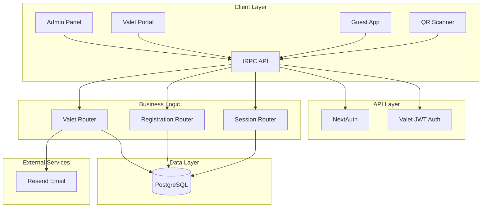

---

## 2. Authentication Flow

### 2.1 Valet Employee Login

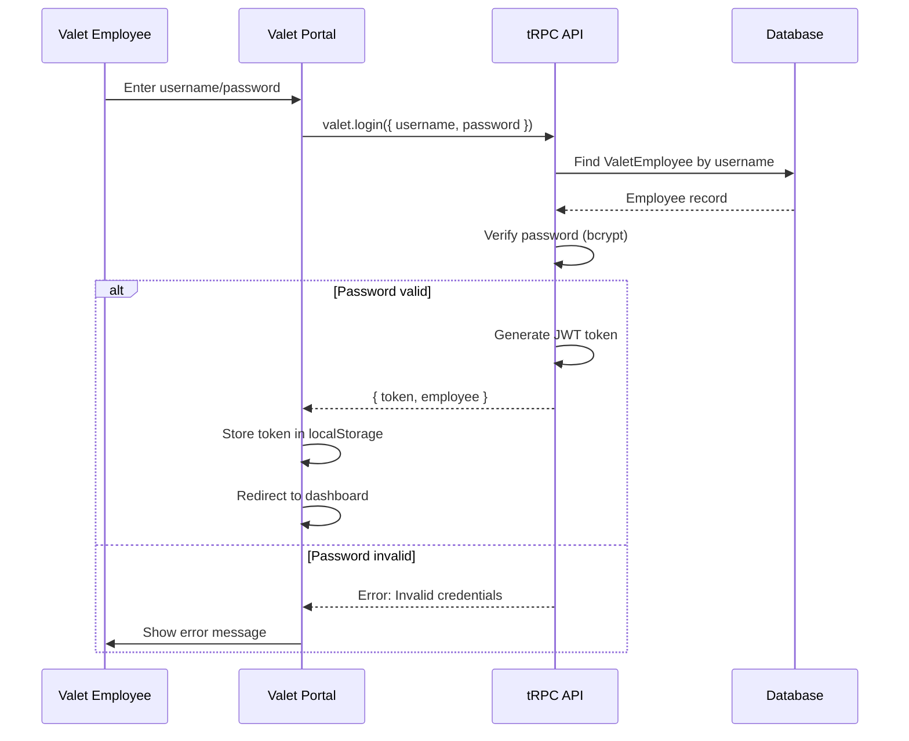

### 2.2 Valet Procedure Middleware

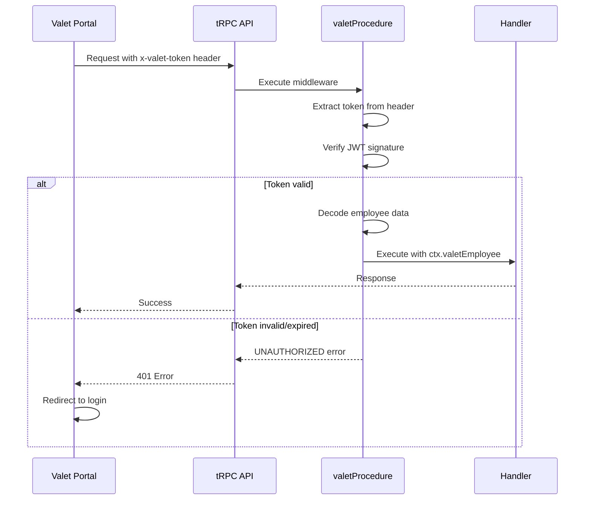

---

## 3. Registration Flow with Valet

### 3.1 Guest Registration with Valet Request

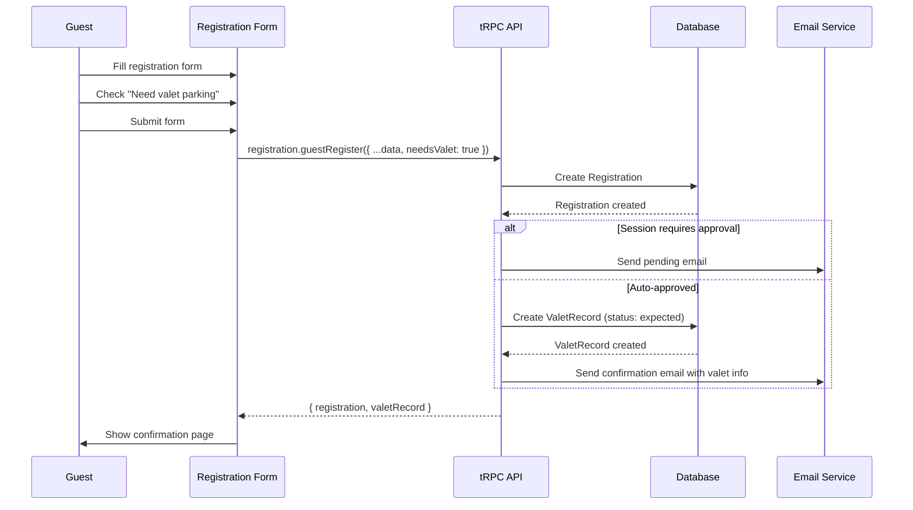

### 3.2 Admin Approves Registration with Valet

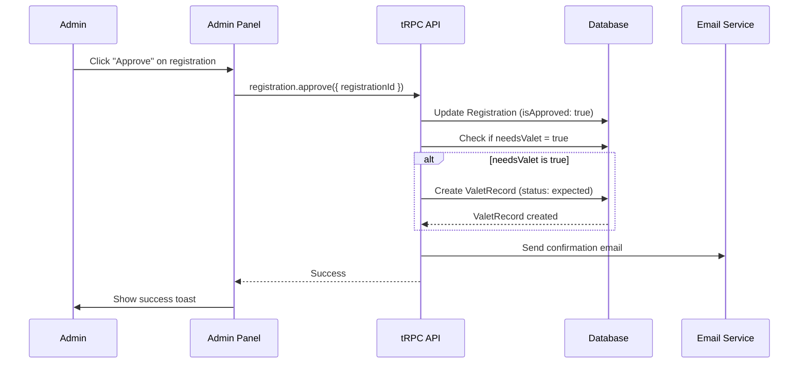

---

## 4. Vehicle Parking Flow

### 4.1 Park Vehicle via Search

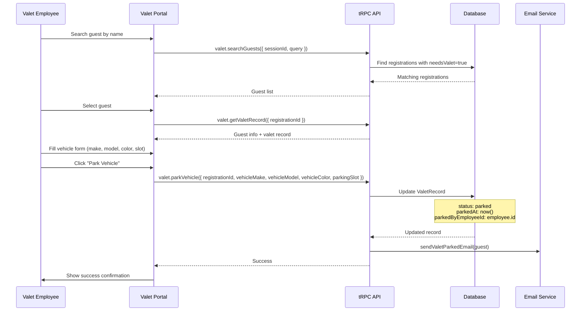

### 4.2 Park Vehicle via QR Scan

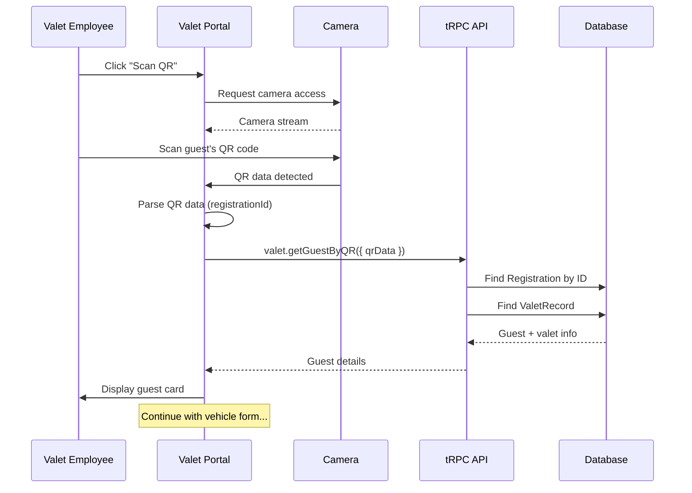

---

## 5. Retrieval Flow

### 5.1 Guest Requests Retrieval (App)

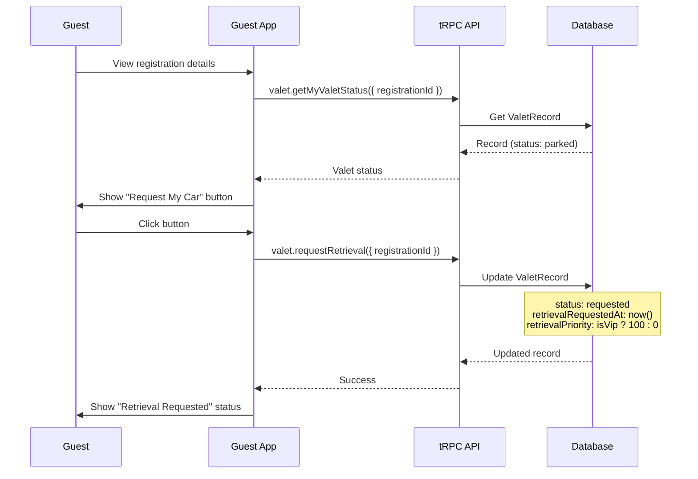

### 5.2 Guest Requests Retrieval (QR)

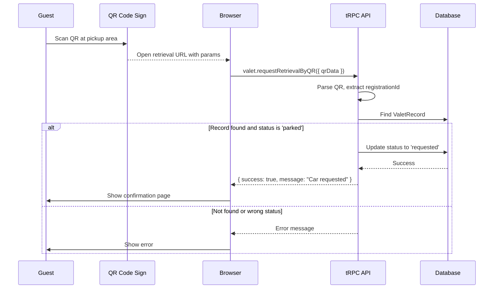

### 5.3 Valet Processes Retrieval Queue

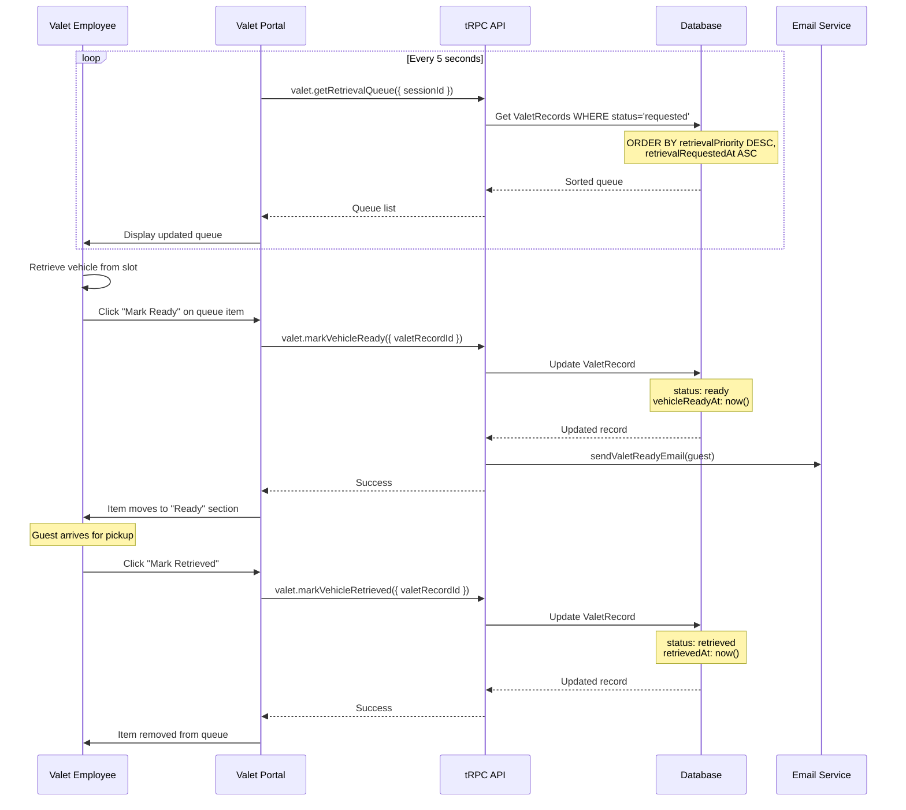

---

## 6. Admin Monitoring Flow

### 6.1 View Live Statistics

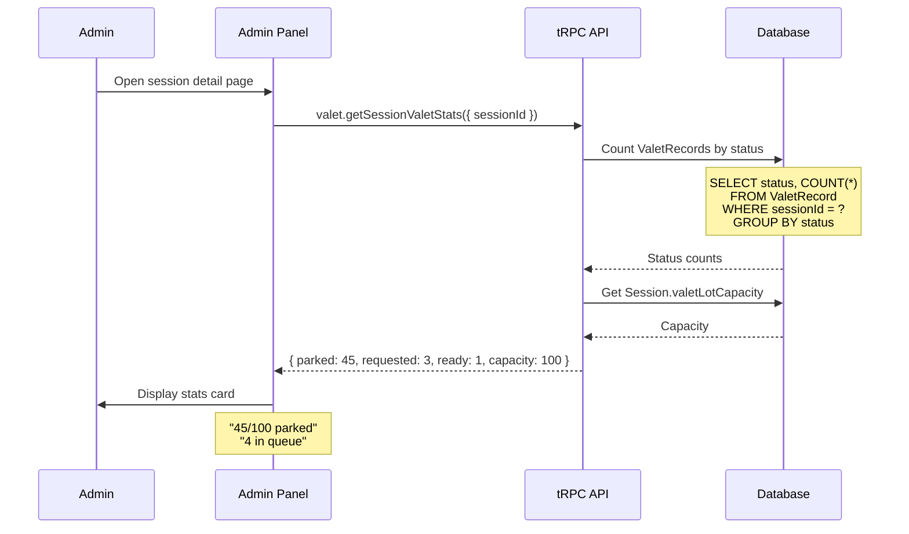

### 6.2 Send Broadcast Message

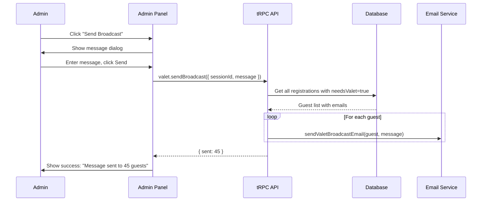

---

## 7. Data Flow Diagrams

### 7.1 ValetRecord State Machine

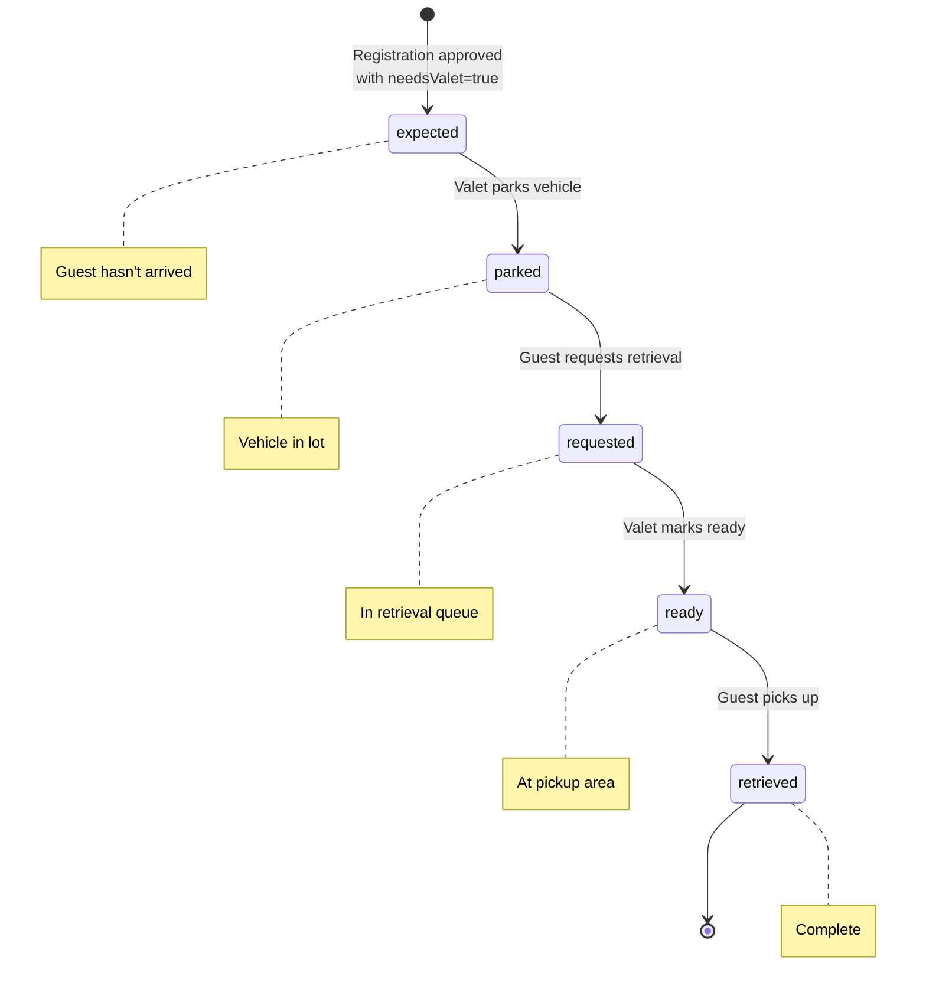

### 7.2 Notification Triggers

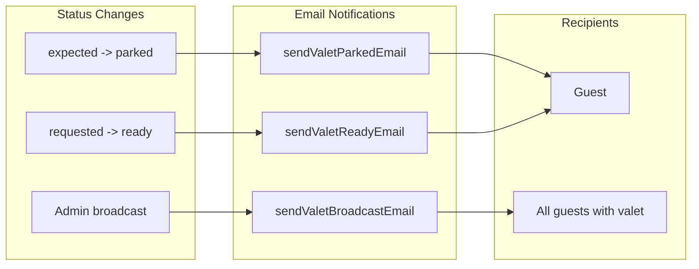

---

## 8. Database Queries

### 8.1 Get Retrieval Queue (Priority Sorted)

```sql
SELECT
    vr.*,
    r.id as registration_id,
    COALESCE(u.name, r.guest_name) as guest_name,
    COALESCE(u.phone, r.guest_phone) as guest_phone
FROM valet_record vr
JOIN registration r ON vr.registration_id = r.id
LEFT JOIN "user" u ON r.user_id = u.id
WHERE vr.session_id = $1
  AND vr.status = 'requested'
ORDER BY
    vr.retrieval_priority DESC,  -- VIPs first
    vr.retrieval_requested_at ASC  -- Then by request time
```

### 8.2 Get Session Valet Statistics

```sql
SELECT
    COUNT(*) FILTER (WHERE status = 'expected') as expected,
    COUNT(*) FILTER (WHERE status = 'parked') as parked,
    COUNT(*) FILTER (WHERE status = 'requested') as requested,
    COUNT(*) FILTER (WHERE status = 'ready') as ready,
    COUNT(*) FILTER (WHERE status = 'retrieved') as retrieved
FROM valet_record
WHERE session_id = $1
```

### 8.3 Search Guests with Valet

```sql
SELECT
    r.id,
    COALESCE(u.name, r.guest_name) as name,
    COALESCE(u.phone, r.guest_phone) as phone,
    vr.status as valet_status,
    vr.is_vip
FROM registration r
LEFT JOIN "user" u ON r.user_id = u.id
LEFT JOIN valet_record vr ON r.id = vr.registration_id
WHERE r.session_id = $1
  AND r.needs_valet = true
  AND r.is_approved = true
  AND (
    LOWER(u.name) LIKE LOWER($2 || '%')
    OR LOWER(r.guest_name) LIKE LOWER($2 || '%')
  )
LIMIT 10
```

---

## 9. API Request/Response Examples

### 9.1 Park Vehicle

**Request:**
```typescript
api.valet.parkVehicle.mutate({
  registrationId: "clxyz123",
  vehicleMake: "Toyota",
  vehicleModel: "Camry",
  vehicleColor: "White",
  vehiclePlate: "ABC 1234",  // optional
  parkingSlot: "A-15"
})
```

**Response:**
```typescript
{
  id: "clvalet456",
  registrationId: "clxyz123",
  guestName: "Ahmed Mohammed",
  status: "parked",
  vehicleMake: "Toyota",
  vehicleModel: "Camry",
  vehicleColor: "White",
  parkingSlot: "A-15",
  parkedAt: "2026-01-15T18:30:00Z"
}
```

### 9.2 Get Retrieval Queue

**Request:**
```typescript
api.valet.getRetrievalQueue.query({
  sessionId: "clsession789"
})
```

**Response:**
```typescript
[
  {
    id: "clvalet111",
    guestName: "VIP Guest",
    guestPhone: "+966501234567",
    isVip: true,
    vehicleMake: "Mercedes",
    vehicleModel: "S-Class",
    vehicleColor: "Black",
    parkingSlot: "VIP-1",
    retrievalRequestedAt: "2026-01-15T22:00:00Z",
    retrievalPriority: 100
  },
  {
    id: "clvalet222",
    guestName: "Regular Guest",
    guestPhone: "+966509876543",
    isVip: false,
    vehicleMake: "Honda",
    vehicleModel: "Accord",
    vehicleColor: "Silver",
    parkingSlot: "B-23",
    retrievalRequestedAt: "2026-01-15T21:55:00Z",
    retrievalPriority: 0
  }
]
```

---

## 10. Error Handling

### 10.1 Error Codes

| Code | Message | Cause |
|------|---------|-------|
| `VALET_NOT_ENABLED` | Valet not enabled for this session | Session.valetEnabled is false |
| `ALREADY_PARKED` | Vehicle already parked | ValetRecord.status is not 'expected' |
| `NOT_PARKED` | Vehicle not parked yet | Trying to request retrieval when status is 'expected' |
| `ALREADY_REQUESTED` | Retrieval already requested | ValetRecord.status is 'requested' or 'ready' |
| `CAPACITY_FULL` | Parking lot is full | Parked count >= Session.valetLotCapacity |
| `GUEST_NOT_FOUND` | Guest not found | No registration with given ID |
| `INVALID_QR` | Invalid QR code | QR data cannot be parsed |

### 10.2 Error Response Format

```typescript
{
  code: "ALREADY_REQUESTED",
  message: "You have already requested your car. Current queue position: 3"
}
```
